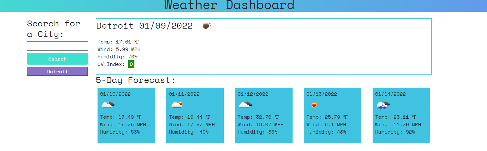

# Weather Dashboard App

## Description
The weather dashboard app was created using javaScript, jquery, html, and css.  The application uses the Open Weather API to get weather data by city name.  The user is able to enter a city name into the input field and when the user hits the submit button, they are presented with the current weather data as well as a five day forecast.  The application saves the search history and appends a new button to the page to click on the previously saved data.  Building this application I learned how to parse data and display that data dynamically.

### Link to deployed site
[weather_app](https://hjohnsick.github.io/Weather-Dashboard/)

